# PRAKTIKUM 4

## Step 1
Pertama-tama, kita memulai dengan membuat list kosong bernama data_mahasiswa. List ini akan berfungsi sebagai wadah untuk menyimpan semua data yang akan dimasukkan oleh pengguna.

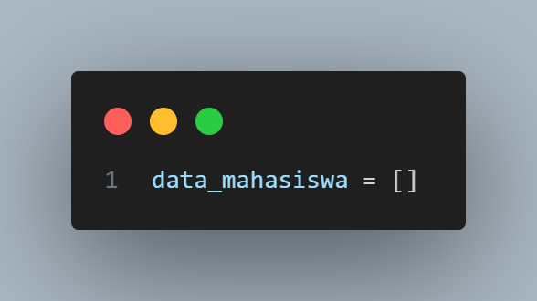

## Step 2
Selanjutnya, kita menggunakan sebuah perulangan while True untuk meminta pengguna memasukkan data secara berulang. Perulangan ini akan terus berjalan sampai pengguna memutuskan untuk berhenti. Di dalam perulangan, program akan menampilkan pesan untuk memasukkan data mahasiswa.

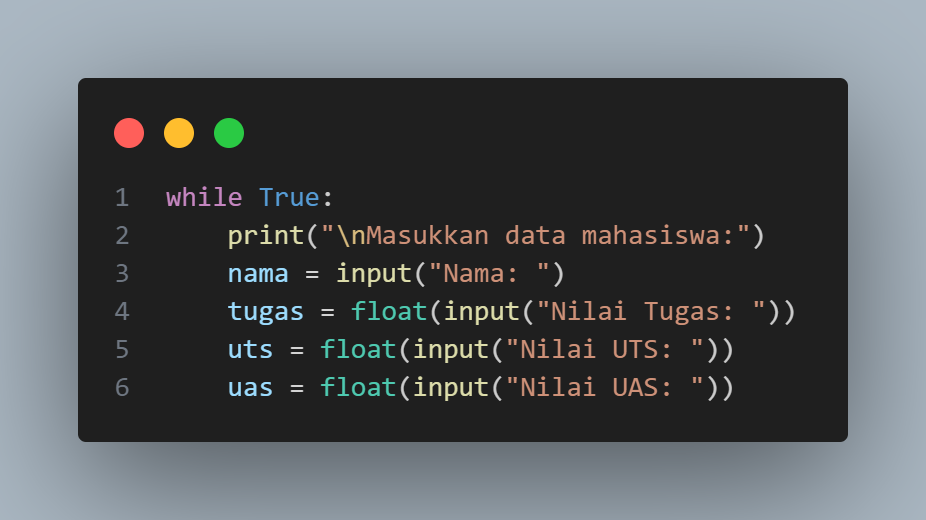

## Step 3
Pada bagian ini, program akan meminta pengguna untuk menginput nama mahasiswa, nilai tugas, nilai UTS, dan nilai UAS. Nilai tugas, UTS, dan UAS dimasukkan sebagai angka desimal (float) untuk memungkinkan input nilai dengan angka pecahan (misalnya 85.5).

Setelah pengguna memasukkan data, program akan menghitung nilai akhir mahasiswa. Rumus yang digunakan untuk menghitung nilai akhir adalah sebagai berikut:

* 30% dari nilai tugas
* 35% dari nilai UTS
* 35% dari nilai UAS

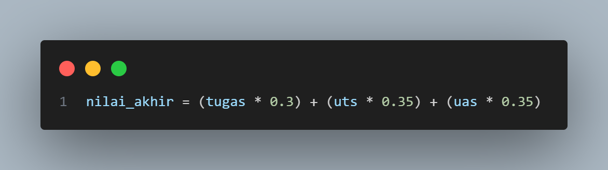

## Step 4
Setelah nilai akhir dihitung, program menyimpan semua informasi yang sudah dimasukkan (nama, nilai tugas, UTS, UAS, dan nilai akhir) ke dalam list data_mahasiswa. Data tersebut disimpan dalam bentuk dictionary agar lebih terstruktur.

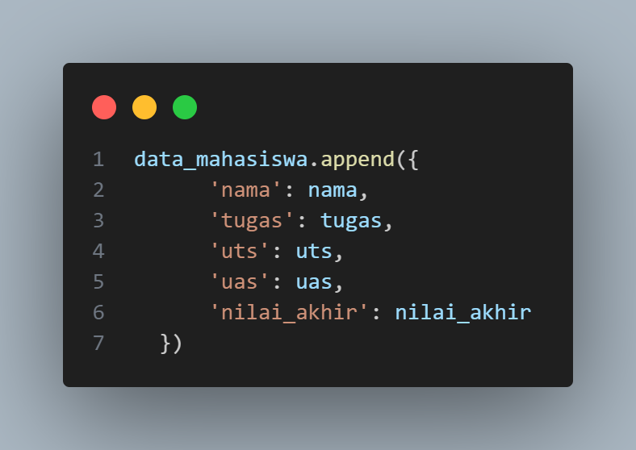

## Step 5
Setiap kali data mahasiswa baru ditambahkan, program akan menanyakan apakah pengguna ingin menambahkan data mahasiswa lain. Jika pengguna menjawab 'y', program akan kembali ke awal perulangan dan meminta input data lagi. Namun, jika pengguna menjawab 't', program akan keluar dari perulangan dan mulai menampilkan daftar data yang sudah dikumpulkan.

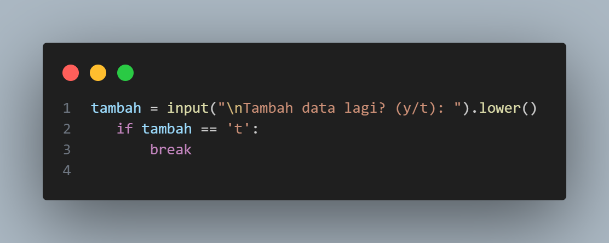

## Step 6
Setelah keluar dari perulangan, program akan mencetak daftar seluruh mahasiswa beserta nilai-nilai mereka dalam format tabel. Program menggunakan perulangan for untuk membaca setiap elemen dalam list data_mahasiswa dan menampilkannya satu per satu.

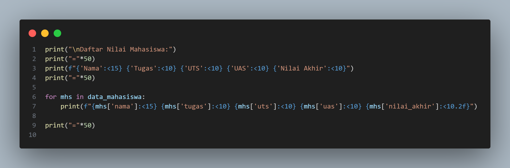

# OUTPUT
Maka, program akan menghasilkan output seperti berikut:

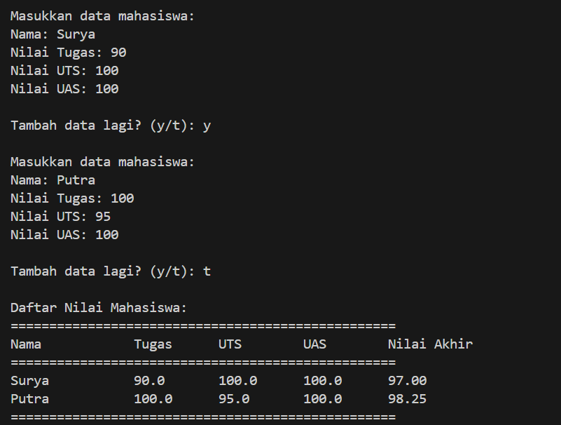

# Flowchart

## Step 1 : Start
Titik Mulai:

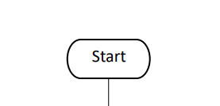

## Step 2 : Input Data Mahasiswa
Buatkan Input Data Mahasiswa dengan mencangkup Nama, Nim, Nilai Tugas, Nilai UTS, Nilai UAS :

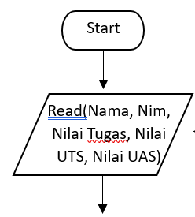

## Step 3 : Lakukan Seleksi
Langkah selanjutnya yaitu buatkan decision atau seleksi berupa pertanyaan Menambahkan Data Mahasiswa (Y/T?), jika Ya maka kemabli ke Input Data mahasiswa, jika Tidak maka lanjut ke langkah selanjutnya :

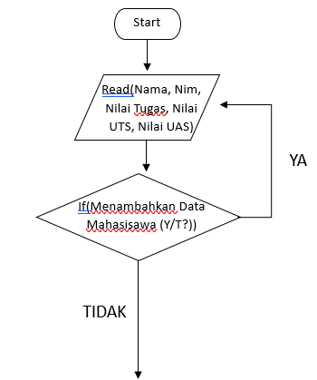

## Step 4 : Proses Perhitungan
Langkah ini untuk memproses Nilai Akhir dari Input nilai nilai yang telah dimasukan :

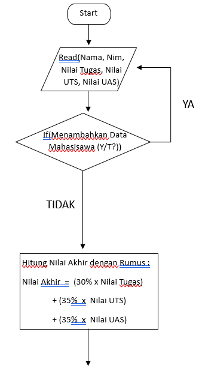

## Step 5 : Output Nilai Akhir
Masuk kelangkah Akhir yaitu menampilkan Nilai Akhir dari Data Mahasiswa yang telah diinputkan dan sudah dihitung :

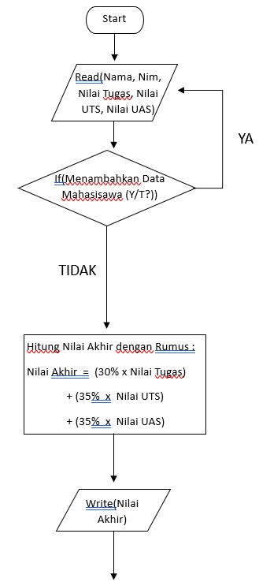

## Step 6 : End
Titik Berhenti :

# KESIMPULAN :
Kesimpulan dari Laporan Praktikum ini adalah penggunaan append yaitu dapat menambahkan element lain, jika kita perhatikan penggunaan perulangan sangat membantu untuk memastikan jika ada tambahan data yang diinputkan, namun dari semua itu semua adalah kelas dari sebuah List dari tema praktikum kali ini. Penggunaan List berguna untuk mengetahui apa saja yang ada di dalam data, List mampu menampung beberapa element berbeda.